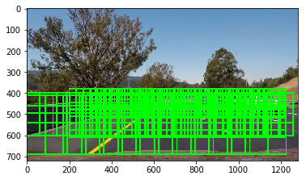

**Vehicle Detection Project**

The goals / steps of this project are the following:

* Perform a Histogram of Oriented Gradients (HOG) feature extraction on a labeled training set of images and train a classifier Linear SVM classifier
* Optionally, you can also apply a color transform and append binned color features, as well as histograms of color, to your HOG feature vector. 
* Note: for those first two steps don't forget to normalize your features and randomize a selection for training and testing.
* Implement a sliding-window technique and use your trained classifier to search for vehicles in images.
* Run your pipeline on a video stream (start with the test_video.mp4 and later implement on full project_video.mp4) and create a heat map of recurring detections frame by frame to reject outliers and follow detected vehicles.
* Estimate a bounding box for vehicles detected.

[//]: # (Image References)
[image1]: ./examples/car_not_car.png
[image2]: ./examples/HOG_example.jpg
[image3]: ./examples/sliding_windows.jpg
[image4]: ./examples/sliding_window.jpg
[image5]: ./examples/bboxes_and_heat.png
[image6]: ./examples/labels_map.png
[image7]: ./examples/output_bboxes.png
[video1]: ./project_video.mp4

the highway. This project was carried out in the following steps:

1. Features were extracted from a training set and normalized. These included spatial features, color histogram features and features from a Histogram of Oriented Gradients (HOG)
2. The features extracted from the training set were used to train and validate a Linear SVM classifer
3. A set of search windows were created in the relevant field of view of the camera and a sliding window technique was used to search for vehicles in the frame with the classifier
4. Positive returns were recorded in a heat map. Heat maps from recent frames were saved and summed together to create and average heatmap over the recent frames. The average heatmap was thresholded to extract only repeat hits and eliminate false positives.
5. False positives that did not overlap the tracked vehicle boxes were automatically extracted from the image and saved to be used with hard negative mining during future retraining of the classifier.
6. Video outputs of the dectected boxes, the thresholdded boxes and the heatmaps were generated. The functions from project 4 were used to overlay lane detection in the video.

## 1 Feature Extraction
Through most of the attempts at solving this project combinations of spatial features, color histogram features and HOG features were used for classification. Changing parameters generally resulted in small changes in the validation accuracy and were often difficult to quantify. Validation accuracy was approximately 91% without HOG features and ranged from 97 to 97.5% with HOG features in RGB color space. The critical effect of changes to the features on false positves was not measurable until applied to the video.

More features generally resulted in higher accuracy, but there was a premium on removing features to save processing time.

An overview of the parameters selected for the classifer and those attempted, shown in brackets are given below.

* color_space:  YCrCb
* orient:  9 
* pix_per_cell:  16 
* cell_per_block:  2
* hog_channel:  ALL
* spatial_size:  32x32
* hist_bins:  32
* spatial_feat:  True
* hist_feat:  True

The final feature vector size was 4140. A significant performance improvement with little effect on accuracy was acheived by setting the HOG pix_per_cell to 16 instead of 8. The output features of HOG were not visualizes as adequate visualizations are found in the course material.

Features were then scaled with the `sklearn.preprocessing StandardScaler`

Most of the work was done in the RGB color space. The many false positives lead to much experimentation with the classifier parameters. No other classifiers were attempted based on some reports from colleagues. If false positives had not been solved, I would have attempted a deep neural network.

Almost all of the code used for feature extraction and training the classifier was taken from the course material and checked. This makes use of the `skimage.hog` function. This section of the project can be found in [vehicle_detection.ipynb](vehicle_detection.ipynb) This notebook outputs a pickled classifier, scaler and parameters.

**Improvements:** Further optimization of number of parameters vs. run time vs. accuracy vs. false positives could have been carried out.

## 2 Training the classifier

The `sklearn.svm LinearSVC` was used based on recommendations in the course and slack channel for being faster than other classifiers and effective.

Two, 65MB, 8800 image traning sets were used, linked from the course website. One containing 64x64pixel car images and the other containing non-car images. False positive images were also saved and used for training at later stages.

**Improvements:** More data from the Udacity training set could have been used to improve the performance of the classifer. At 98.45% validation accuracy, we are already in the realm of overfitting. The hard negative mining did appear to have a good effect at reducing false positives.

## 3 Sliding windows generation

The slide_window function from the course material was used to generate field sets of search windows which were used by the classifier to detect vehicles.

Parameters for the windows were varied throughout the project but ultimately the four following fieldsets given below were used.

* Windows1:
y_start_stop1 = [380, 580]
x_start_stop1 = [200,1200]
win_size1 = (96,96) xy_overlap=(0.65, 0.65)

* Windows2:
y_start_stop2 = [400,592]
x_start_stop2 = [0,1280]
win_size2 = (140,140) xy_overlap=(0.55, 0.55)

* Windows3:
y_start_stop3 = [410,680]
x_start_stop3 = [0,1280]
win_size3 = (192,192) (0.55, 0.55)

* Windows 4:
y_start_stop4 = [380,508]
x_start_stop4 = [300,1200]
win_size4 = (64,64) xy_overlap=(0.6, 0.6)

(extra smaller windows)

* Combined Search windows:

These windows were manually set to attempt to capture the scales at which cars were occuring at different points in the image.

There was an obvious trade off between the number of windows, the run time and tracking performance of the program. More windows resulted in more accurate label box sizes, smooth tracking and more overlapping detections of the vehicles but they would quickly slow down the program.

In each frame of the video, data from every one of the these windows was rescaled and sent to the feature extractor and classifier for detection. This is done with the `search_windows` function which has been adapted from the course material. This function calls the `single_img_features` which is also adapted from the course material.

An example of detected windows is given below:

## 4 Tracking with Heatmaps

A heatmap class was created to store properties of the current heatmap, the moving average heatmap and the thresholded heatmap across video frames. `class heatmap_obj:` This was done based on suggestions in the course material.

*Heat* was added to the current heatmap for positive detections in each video frame. The current heatmap was then appended to a moving list of heatmaps from *num_history* video frames and these were summed together. In some cases, heat could be re-added to a pixel based on multiple overlapping detections, for the RGB color space this was not allowed.

The summed heatmap was then thresholded based on the *threshold_detections* parameter and this was used with the `scipynd.image.measurements label` function to find unconnected regions in the thresholded heatmap. These were drawn onto the video frames as outline boxes.

Initially, a good deal of tuning was done to manage the large number of false positives resulting from classification in RGB color space. To solve this many frames were summed together: 44 and a high detection threshold was used: 40.

40 detections in a region were required to occur across 44 frames in order for a box to be labelled.

Labelled boxes were also checked for a minimum size of 64x64 pixels with the `check_box` function in order to eliminate small overlapping regions resulting in an output.

Example heatmap output is shown in the video for tracking in RGB color space. The high detection threshold and large moving average eliminate the many false positives.

* Top Left: Output video
* Bottom Left: Frame by frame output of detected windows
* Top Right: Heatmap
* Bottom Right: Thresholded heatmap

## 6 Results

After fixing a bug and properly switching to all channels of the YCrCb color_space for HOG feature extraction, tracking vehicles with minimal false positives became much easier. The threshold for detection was relaxed to 6 detections per 14 frames stored in the moving average.

The results for tracking in the YCrCb color space can be found here:

<a href="https://youtu.be/haj7xiOgNuc" target="blank" >test video</a>

<a href="https://youtu.be/cZVXoScec2I" target="blank" >project video</a>

